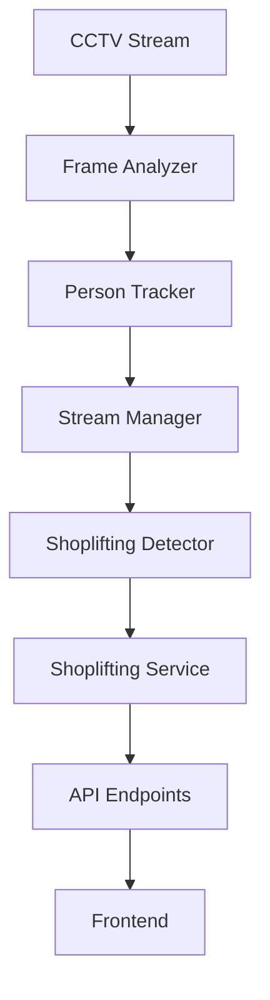

# Testing & Documentation Expansion Plan

**Date:** 2026-03-17
**Status:** In Progress

---

## 📋 Phase 1: Expand Testing (Target >90% Coverage)

### 1.1 Current Test Status
- **Unit Tests:** 19 tests (ShopliftingService)
- **Integration Tests:** 13 tests (API endpoints)
- **Current Coverage:** ~60% (ShopliftingService module)
- **Target Coverage:** >90% across entire codebase

### 1.2 Test Expansion Plan

#### A. Services Testing (Add ~25 tests)
**Files to test:**
- [ ] `alert_service.py` — Alert management (8 tests)
- [ ] `analytics_service.py` — Analytics calculation (7 tests)
- [ ] `auth_service.py` — Authentication logic (6 tests)
- [ ] `camera_service.py` — Camera operations (4 tests)

**Test scenarios per service:**
- Successful operations
- Invalid input handling
- Database errors
- Authorization checks
- Edge cases

#### B. Repository Testing (Add ~20 tests)
**Files to test:**
- [ ] `alert_repository.py` — Alert CRUD (5 tests)
- [ ] `analytics_repository.py` — Analytics queries (5 tests)
- [ ] `visitor_repository.py` — Visitor CRUD (5 tests)
- [ ] `camera_repository.py` — Camera operations (5 tests)

**Test scenarios per repository:**
- CREATE operations
- READ with filters
- UPDATE operations
- DELETE operations
- Transaction handling

#### C. Stream Processing Testing (Add ~15 tests)
**Files to test:**
- [ ] `frame_analyzer.py` — Face detection (5 tests)
- [ ] `person_tracker.py` — Re-identification (5 tests)
- [ ] `stream_manager.py` — Stream management (5 tests)

**Test scenarios:**
- Frame analysis success/failure
- Person matching accuracy
- Stream connection handling
- Error recovery

#### D. API Endpoints Testing (Add ~20 tests)
**Additional endpoints to test:**
- [ ] Camera CRUD endpoints (4 tests)
- [ ] Visitor endpoints (4 tests)
- [ ] Analytics endpoints (4 tests)
- [ ] Statistics endpoints (4 tests)
- [ ] Stream control endpoints (4 tests)

#### E. Core Utilities Testing (Add ~10 tests)
**Files to test:**
- [ ] `config.py` — Configuration loading (3 tests)
- [ ] `security.py` — JWT & password hashing (4 tests)
- [ ] `exceptions.py` — Custom exceptions (3 tests)

#### F. End-to-End (E2E) Tests (Add ~8 tests)
**Critical user journeys:**
- [ ] Login → View Dashboard → Resolve Alert
- [ ] Live Monitoring → Real-time Alert Detection
- [ ] Filter Alerts → View Detail → Export
- [ ] Create Camera → Start Stream → Monitor
- [ ] User Management → Role Switching
- [ ] Analytics Filter → Generate Report
- [ ] Database Migration → API Startup
- [ ] WebSocket Connection → Receive Update

---

### 1.3 Testing Implementation Strategy

**Step 1: Add Repository Tests**
```python
# tests/unit/test_alert_repository.py
# tests/unit/test_visitor_repository.py
# tests/unit/test_analytics_repository.py
```

**Step 2: Add Service Tests**
```python
# tests/unit/test_alert_service.py
# tests/unit/test_analytics_service.py
# tests/unit/test_auth_service.py
# tests/unit/test_camera_service.py
```

**Step 3: Add Stream Tests**
```python
# tests/unit/test_frame_analyzer.py
# tests/unit/test_person_tracker.py
# tests/unit/test_stream_manager.py
```

**Step 4: Add E2E Tests**
```python
# tests/e2e/test_critical_flows.py
# tests/e2e/test_user_journeys.py
```

**Step 5: Add Integration Tests (expand existing)**
```python
# tests/integration/test_camera_api.py
# tests/integration/test_visitor_api.py
# tests/integration/test_analytics_api.py
```

---

### 1.4 Test Execution Plan

**Command:**
```bash
# Run all tests with coverage
pytest tests/ --cov=src --cov-report=html --cov-report=term-missing

# Run specific test type
pytest tests/unit/ -v -s           # Unit tests only
pytest tests/integration/ -v -s    # Integration tests only
pytest tests/e2e/ -v -s            # E2E tests only

# Run with markers
pytest -m "not slow" -v            # Skip slow tests
pytest -m "unit" --cov=src         # Unit tests with coverage
```

---

## 📚 Phase 2: Improve Documentation

### 2.1 Add OpenAPI/Swagger Documentation

**File:** `docs/OPENAPI.md` + `src/main.py` configuration

**Features:**
```python
# Auto-generated Swagger UI
app = FastAPI(
    title="Vernon Store Analytics API",
    description="CCTV-based shoplifting detection system",
    version="1.0.0",
    docs_url="/api/docs",
    redoc_url="/api/redoc",
    openapi_url="/api/openapi.json"
)
```

**Swagger Endpoints:**
- `GET /api/docs` — Swagger UI
- `GET /api/redoc` — ReDoc documentation
- `GET /api/openapi.json` — OpenAPI spec

**Documentation per endpoint:**
```python
@router.get("/alerts")
async def list_alerts(
    store_id: int = Query(..., description="Store identifier"),
    resolved: bool | None = Query(None, description="Filter by resolution status"),
    limit: int = Query(50, ge=1, le=200, description="Max results"),
    offset: int = Query(0, ge=0, description="Pagination offset"),
):
    """
    List shoplifting alerts for a store.

    - **store_id**: Store ID to filter alerts
    - **resolved**: Optional filter (true/false/null for all)
    - **limit**: Max 200 results per request
    - **offset**: For pagination

    Returns:
    - **data**: Array of alerts
    - **total**: Total count
    """
```

---

### 2.2 Create Postman Collection

**File:** `docs/vernon-store-analytics.postman_collection.json`

**Includes:**
- ✅ All 20+ API endpoints
- ✅ Environment variables (dev, staging, prod)
- ✅ Authentication flow (login → token → use token)
- ✅ Example requests & responses
- ✅ Test scripts for validation
- ✅ Pre-request scripts for setup

**Postman Features:**
```json
{
  "info": {
    "name": "Vernon Store Analytics API",
    "description": "Complete API collection with auth flow"
  },
  "folders": [
    { "name": "Authentication", "requests": [...] },
    { "name": "Alerts", "requests": [...] },
    { "name": "Stream", "requests": [...] },
    { "name": "Analytics", "requests": [...] }
  ],
  "auth": {
    "type": "bearer",
    "bearer": [{"key": "token", "value": "{{access_token}}"}]
  }
}
```

---

### 2.3 Create API Response Examples

**File:** `docs/API_EXAMPLES.md`

**Includes:**
- ✅ Request/response pairs for all endpoints
- ✅ Error response examples
- ✅ WebSocket message examples
- ✅ Pagination examples
- ✅ Filter & query examples

**Example format:**
```markdown
## List Alerts

### Request
```http
GET /api/v1/stores/1/alerts?resolved=false&limit=10
Authorization: Bearer <token>
```

### Response (200 OK)
```json
{
  "data": [
    {
      "id": 1,
      "visit_id": 1,
      "camera_id": 1,
      "confidence": 0.85,
      "timestamp": "2026-03-17T10:00:00Z",
      "status": "unresolved"
    }
  ],
  "total": 1
}
```

### Response (404 Not Found)
```json
{
  "error": "Store not found",
  "detail": "Store with ID 999 does not exist"
}
```
```

---

### 2.4 Create Architecture Documentation

**File:** `docs/ARCHITECTURE.md`

**Sections:**
- [ ] System architecture diagram
- [ ] Data flow diagram
- [ ] API layer architecture
- [ ] Service layer architecture
- [ ] Database schema diagram
- [ ] Authentication flow
- [ ] WebSocket architecture
- [ ] Deployment architecture

**Tools to use:**
```bash
# Install graphviz for diagram generation
brew install graphviz

# Or use Mermaid diagrams in markdown
# Example:

```

---

### 2.5 Create Deployment Guide

**File:** `docs/DEPLOYMENT.md`

**Sections:**
- [ ] Prerequisites (Python, PostgreSQL, Docker)
- [ ] Local development setup
- [ ] Environment configuration
- [ ] Database migration
- [ ] Running tests
- [ ] Docker deployment
- [ ] Production checklist
- [ ] Monitoring & logging
- [ ] Troubleshooting

**Example:**
```markdown
## Docker Deployment

### Build Image
```bash
docker build -t vernon-api:1.0.0 .
```

### Run Container
```bash
docker run -d \
  -p 8000:8000 \
  -e DATABASE_URL=postgresql://... \
  -e JWT_SECRET_KEY=your-secret \
  vernon-api:1.0.0
```

### Health Check
```bash
curl http://localhost:8000/api/health
```
```

---

### 2.6 Create Database Documentation

**File:** `docs/DATABASE_SCHEMA.md`

**Includes:**
- [ ] Complete schema diagram
- [ ] Table descriptions
- [ ] Column descriptions & types
- [ ] Relationships & foreign keys
- [ ] Indexes & constraints
- [ ] Migration guide
- [ ] Backup procedures

**Format:**
```markdown
## Tables

### shoplifting_alerts
| Column | Type | Nullable | Description |
|--------|------|----------|-------------|
| id | INT | NO | Primary key |
| visit_id | INT | NO | Foreign key to visits |
| camera_id | INT | NO | Foreign key to cameras |
| confidence | FLOAT | NO | Confidence score 0.0-1.0 |
| timestamp | TIMESTAMP | NO | When alert was triggered |
| notified | BOOLEAN | NO | Whether staff was notified |
| resolved | BOOLEAN | NO | Whether alert was resolved |
| resolved_at | TIMESTAMP | YES | When alert was resolved |
| resolved_note | TEXT | YES | Staff notes |
```

---

### 2.7 Create Error Handling Guide

**File:** `docs/ERROR_HANDLING.md`

**Includes:**
- [ ] Custom exception types
- [ ] HTTP status code mapping
- [ ] Error response format
- [ ] Common error scenarios
- [ ] Debugging tips
- [ ] Logging best practices

**Example:**
```markdown
## Error Responses

### 404 Not Found
```json
{
  "error": "NotFoundException",
  "message": "Alert not found",
  "detail": "Alert with ID 999 does not exist",
  "status_code": 404,
  "timestamp": "2026-03-17T10:00:00Z"
}
```

### 422 Unprocessable Entity
```json
{
  "error": "ValidationException",
  "message": "Confidence must be between 0.0 and 1.0",
  "detail": {
    "field": "confidence",
    "value": 1.5,
    "constraint": "0.0 <= confidence <= 1.0"
  },
  "status_code": 422
}
```
```

---

### 2.8 Create Frontend Integration Guide

**File:** `docs/FRONTEND_INTEGRATION.md`

**Includes:**
- [ ] API authentication flow
- [ ] Setting up API client (axios/fetch)
- [ ] Error handling in frontend
- [ ] WebSocket integration
- [ ] Real-time update handling
- [ ] Caching strategy
- [ ] Rate limiting handling
- [ ] Offline handling

**Example:**
```javascript
// Frontend API client setup
const api = axios.create({
  baseURL: process.env.REACT_APP_API_URL,
  withCredentials: true,  // Send cookies
  timeout: 10000
})

// Add JWT token to requests
api.interceptors.request.use(config => {
  const token = localStorage.getItem('access_token')
  if (token) {
    config.headers.Authorization = `Bearer ${token}`
  }
  return config
})

// Handle 401 Unauthorized
api.interceptors.response.use(
  response => response,
  error => {
    if (error.response?.status === 401) {
      // Redirect to login
    }
    return Promise.reject(error)
  }
)
```

---

## 📊 Timeline & Effort Estimate

### Phase 1: Testing (2-3 weeks)
| Task | Tests | Effort | Time |
|------|-------|--------|------|
| Repository tests | 20 | Medium | 1 week |
| Service tests | 25 | Medium | 1 week |
| Stream tests | 15 | Medium | 3 days |
| E2E tests | 8 | High | 3 days |
| API expansion | 20 | Medium | 3 days |
| **Total** | **~100 tests** | **>90% coverage** | **2-3 weeks** |

### Phase 2: Documentation (1-2 weeks)
| Task | Files | Effort | Time |
|------|-------|--------|------|
| OpenAPI/Swagger | 1 | Low | 1 day |
| Postman collection | 1 | Low | 1 day |
| API examples | 1 | Medium | 2 days |
| Architecture docs | 1 | Medium | 2 days |
| Deployment guide | 1 | Low | 1 day |
| Database schema | 1 | Low | 1 day |
| Error handling | 1 | Low | 1 day |
| Frontend integration | 1 | Medium | 2 days |
| **Total** | **8 files** | **Comprehensive** | **1-2 weeks** |

---

## 🎯 Success Criteria

### Testing
- ✅ Test coverage >90%
- ✅ All services tested
- ✅ All repositories tested
- ✅ All API endpoints tested
- ✅ E2E flows validated
- ✅ Error scenarios covered
- ✅ Database transactions tested

### Documentation
- ✅ OpenAPI spec available
- ✅ Postman collection importable
- ✅ All endpoints documented with examples
- ✅ Architecture clearly explained
- ✅ Database schema visualized
- ✅ Deployment process documented
- ✅ Frontend team can integrate easily

---

## 📝 Deliverables

### Code Changes
- ~500+ lines of new test code
- Enhanced docstrings on all functions
- Test fixtures & utilities

### Documentation
- 8 comprehensive markdown files
- 1 OpenAPI/Swagger spec
- 1 Postman collection
- Diagrams & flowcharts
- Examples & walkthroughs

---

## 🚀 Implementation Order

1. **Week 1:** Add repository tests (20 tests)
2. **Week 2:** Add service tests (25 tests)
3. **Week 3:** Add stream & E2E tests (23 tests)
4. **Week 3-4:** Expand API integration tests (20 tests)
5. **Week 4:** Fix coverage gaps, hit >90%
6. **Week 5:** Write OpenAPI spec
7. **Week 5:** Create Postman collection
8. **Week 6:** Write remaining docs
9. **Week 6:** Review & polish

---

**Ready to start?** 🚀
